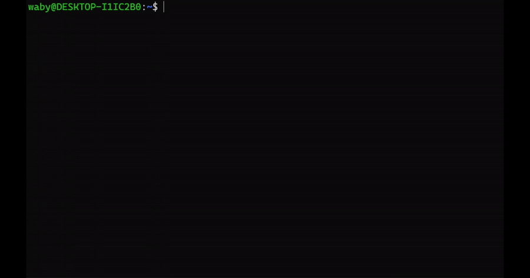

# RepoBoundary

RepoBoundary is a local CLI guardrail for Git repositories. You define protected Git repo-relative paths, and RepoBoundary checks staged changes before commit. If a protected file was created, modified, deleted, or renamed, the commit is blocked with a clear message.

It exists for AI-assisted coding workflows where agents can edit many files quickly. Prompts guide the agent; RepoBoundary verifies what actually reached Git staging.

## Demo

RepoBoundary blocks a commit when a protected path is modified:



[Watch the MP4 demo](assets/demo.mp4)

## Honest V0 Limits

RepoBoundary V0 blocks commits, not file writes. It does not stop an AI agent, editor, script, or developer from changing files on disk.

RepoBoundary is not a sandbox, antivirus, malware scanner, secret scanner, or complete security system. It is a local pre-commit check for protected staged changes. The implemented CLI reads local Git state and `.repoboundary.json`; it does not upload your code.

Rules use Git repo-relative paths and glob patterns, such as `src/auth/**` or `prisma/schema.prisma`. Do not use absolute filesystem paths like `/tmp/project/src/auth/**` or `C:\project\src\auth\**`.

## Install

For a local demo from this checkout:

```bash
npm install
npm run build
npm link
```

Then confirm the CLI is available:

```bash
repoboundary --help
```

## Quick Start

Run inside a Git repository:

```bash
repoboundary init
repoboundary add "src/auth/**" --reason "Sensitive authentication logic"
```

The path passed to `add` is relative to the Git repository root. RepoBoundary V0 only checks what is staged in Git before a commit; it does not prevent file writes.

Now try the demo flow:

```bash
# edit or create a file under src/auth/
git add .
git commit -m "test protected change"
```

The commit is blocked if the staged changes touch `src/auth/**`.

## Commands

```bash
repoboundary init
```

Creates `.repoboundary.json` if missing and installs or updates the Git `pre-commit` hook without overwriting existing hook content.

```bash
repoboundary add "src/auth/**" --reason "Sensitive authentication logic"
```

Adds a protected Git repo-relative path or glob rule. `--reason` is required. Absolute filesystem paths are rejected.

```bash
repoboundary remove src-auth
```

Removes one protected rule by ID.

```bash
repoboundary status
```

Shows the repo root, config status, hook status, rule count, and rule details.

```bash
repoboundary check
```

Manually checks currently staged changes. Exit codes are `0` for pass, `1` for protected staged changes, and `2` for Git/config/internal errors.

## Config Example

`.repoboundary.json`:

```json
{
  "version": 1,
  "rules": [
    {
      "id": "src-auth",
      "match": ["src/auth/**"],
      "actions": ["create", "modify", "delete", "rename"],
      "mode": "block",
      "reason": "Sensitive authentication logic"
    }
  ]
}
```

V0 supports `mode: "block"` only.

Each `match` entry is interpreted against Git's repo-relative staged paths. Use `src/auth/**`, not `/home/me/project/src/auth/**` or `C:\project\src\auth\**`.

## Blocked Commit Example

```txt
RepoBoundary blocked this commit.

Protected files were modified:

1. src/auth/session.ts
   Action: create
   Rule: src-auth
   Reason: Sensitive authentication logic

To continue:
- review the diff manually
- revert the protected changes
- or update/remove the rule if this change is intentional
```

## Common Protected Paths

```bash
repoboundary add "src/auth/**" --reason "Sensitive authentication logic"
repoboundary add "src/payments/**" --reason "Payment logic requires review"
repoboundary add "prisma/schema.prisma" --reason "Database schema changes require review"
repoboundary add "supabase/migrations/**" --reason "Database migrations require review"
repoboundary add ".github/workflows/**" --reason "CI/CD changes require review"
repoboundary add ".env.example" --reason "Environment contract changes require review"
```

## Troubleshooting

If `repoboundary init` says you are outside a Git repository, run it from a repo or initialize one with `git init`.

If `add`, `remove`, or `check` says the config is missing, run:

```bash
repoboundary init
```

If commits are not being checked, run:

```bash
repoboundary status
```

If the config is invalid, fix `.repoboundary.json` so it matches the schema above. Invalid config fails closed and blocks `check`/pre-commit validation.

If a protected change is intentional, review the diff first. Then either revert the protected change, remove the rule, or update `.repoboundary.json` deliberately.

## Development

```bash
npm install
npm run typecheck
npm run test
npm run build
node dist/cli.js --help
```
